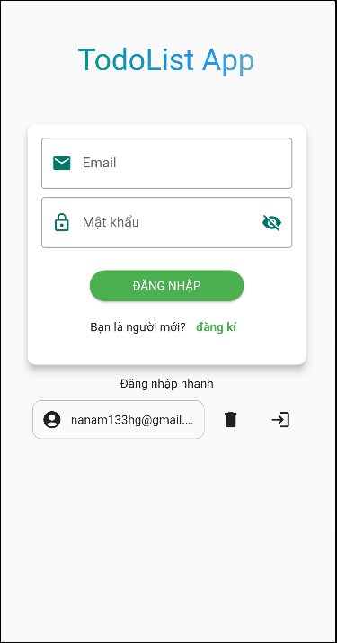
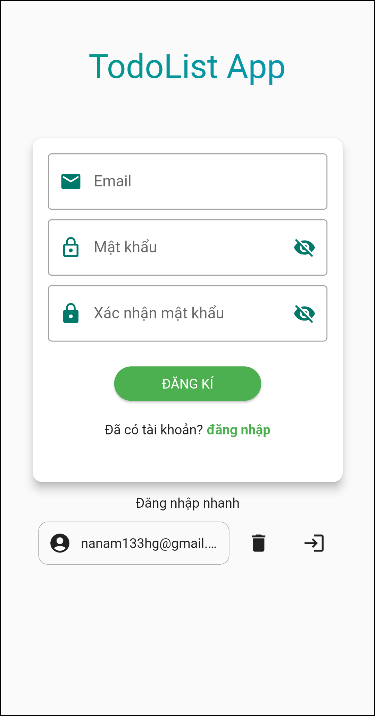
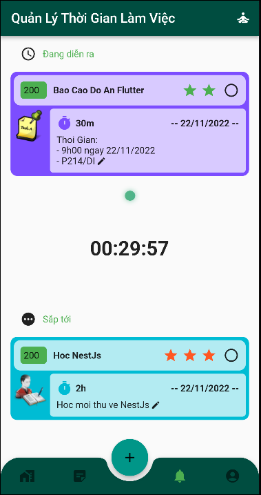
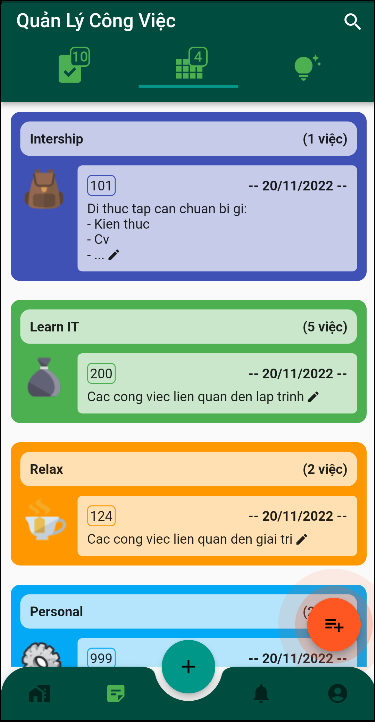
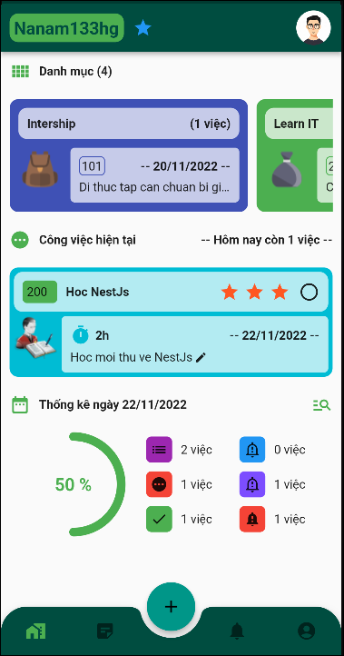
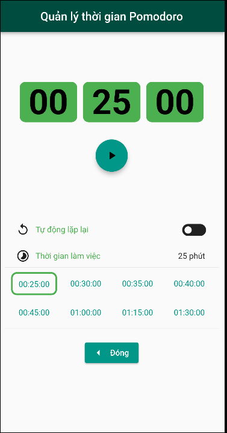
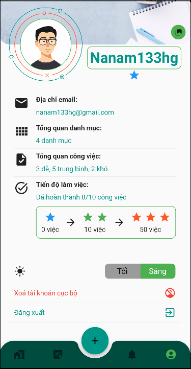
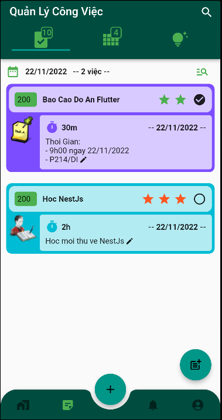
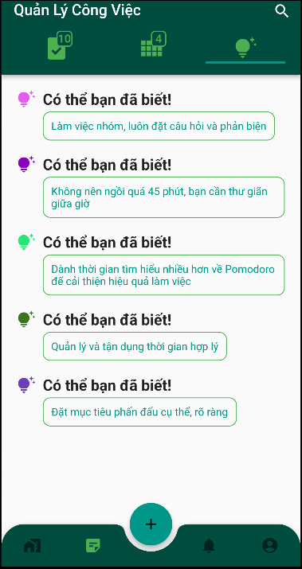

## Todolist App

### Giới thiệu:

- Ứng dụng quản lý các việc cần làm, với ghi chú và thời gian làm việc.
- Đồ án môn `Phát Triển Ứng Dụng Di Động CT484` của `TS. Bùi Võ Quốc Bảo`, trường `Đại Học Cần Thơ`.

### Các chức năng:

- `Tài Khoản`: Đăng nhập, Đăng kí tài khoản mới.
- `Quản lý tài khoản cục bộ`: Xoá mật khẩu cục bộ, Đăng Nhập Nhanh, Đổi ảnh bìa.
- `Quản lý danh mục công việc`: Xem/Thêm/Sửa/Xoá danh mục làm việc, Đổi thứ tự công việc theo ngày.
- `Quản lý công việc`: Xem/Thêm/Sửa/Xoá công việc.
- `Tìm kiếm`: danh mục/công việc theo tên.
- `Thống kê công việc`: Tiến độ hoàn thành công việc theo ngày, Tổng số công việc theo mức độ Dễ - Vừa - Khó.
- `Đánh giá mức độ làm việc của người dùng`: Số sao tuỳ theo số công việc đã hoàn thành.
- `Thay đổi giao diện`: Ban ngày, Ban đêm.
- `Tip học tập`: Show ngẫu nhiên 5 mẹo mỗi lần xem.

### Lưu trữ dữ liệu

- `API`: Firebase authentication with email/password
- `Local`:
  - Shared Preferences (pub dev): Lưu trữ tài khoản vào bộ nhớ cục bộ của HĐH Android.
  - Sqflite (pub dev): Lưu trữ dữ liệu về Danh mục, Công việc.

### Hướng phát triển

- `Mục đích`: Ứng dụng hoàn toàn sử dụng Offline, mọi dữ liệu đều do người dùng quản lý, không có sự can thiệp của bên nào kể cả nhà phát triển.
- `Chi tiết`:
  - Bỏ đăng nhập với API Firebase.
  - Tạo xác thực với mã PIN.
  - Chức năng import dữ liệu bằng file.
  - Xuất file thông tin Danh mục/Công việc/PIN.
  - Tạo hướng dẫn cho người sử dụng lần đầu.
  - Fix một số UX, UI đang còn lỗi.

### Một số hình ảnh

  
  
  

---

  
  
  

---

  
  
  

### Trãi nghiệm

- Nếu bạn thích có thể trãi nghiệm thử với file apk: <a href="./readme_images/app-release.apk" download>TodoList_v1.0.1</a>
